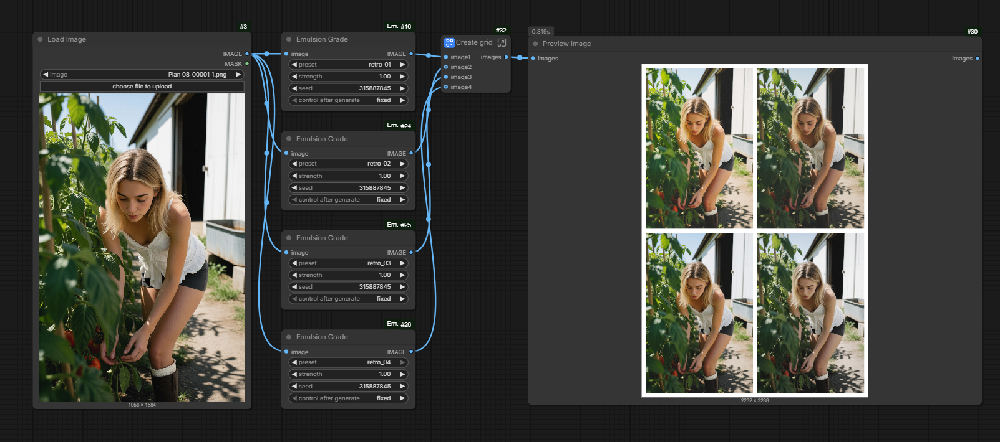

# ComfyUI-Emulsion

JSON-preset color grading, Lightroom-preset style. Two nodes under
`image/postprocessing`:

- **Emulsion Grade** applies a preset in a single pass: levels, tone curve,
  contrast, white balance, HSL, `.cube` LUT, clarity, bloom, halation,
  vignette, grain, and more.
- **Emulsion Extract** does the reverse: from a before/after pair, it recovers
  the grading parameters by optimization and writes a JSON preset reusable by
  Emulsion Grade.



## Installation

```
cd ComfyUI/custom_nodes
git clone https://github.com/24latents/ComfyUI-Emulsion.git
```

Restart ComfyUI. No dependencies to install (torch is provided by ComfyUI).

## Usage

Add the **Emulsion Grade** node, connect an image, pick a preset:

- **preset** — a file from `presets/*.json`. The folder is rescanned on
  browser refresh: no restart needed for a new preset to show up.
- **strength** — 0 = original image, 1 = full grade, > 1 = extrapolation
  (clamped to 0-1).
- **seed** — reproducible grain.

On an invalid preset or a missing LUT, the error is logged to the console and
the image passes through unchanged (the workflow never crashes).

### Emulsion Extract

Connect `image_source` (ungraded) and `image_target` (the same image, graded);
the node fits by gradient descent (Adam, pure torch, CPU or GPU) a 6-point
tone curve, temperature/tint, saturation and an optional vignette, then
estimates grain from the residual high-frequency noise.

- **preset_name** — the `"name"` stored in the JSON; the file itself is
  written under a slugified version of it (`My Look!` → `my_look.json`).
- **iterations** — optimization budget (default 400). More iterations =
  tighter fit but slower. The fit stops early on its own once the error
  stops improving for 50 iterations, so high values only cost time when
  they actually help: ~100 for a quick draft, 400 for most grades,
  800-2000 for stubborn ones. The console shows the final RMSE and the
  number of iterations actually run.
- **fit_vignette** — also fit a vignette (amount, radius, feather). Turn it
  off when the pair has no vignette, so the optimizer cannot abuse it to
  compensate for other differences (e.g. a naturally darker corner). The preset is written
to `presets/<slugified_name>.json` (with a `_2`, `_3`… suffix on collision)
and returned as a STRING; it shows up in the Emulsion Grade dropdown on
browser refresh. The JSON only contains the significantly non-neutral
parameters, plus the achieved RMSE in `description`. The two images may have
different resolutions (e.g. an upscaled target) as long as the aspect ratio
matches: the target is resampled to the source before fitting.

Technical note: during the fit, the tone curve is evaluated with piecewise
linear interpolation between the 6 points (differentiable); at render time,
`grading.py` applies a Catmull-Rom spline through those same points. This
controlled linear-fit / spline-render gap is on the order of the fit noise
(the reported RMSE is measured on the spline render, at native resolution).

## Example workflows

Two ready-to-use workflows ship in [example_workflows/](example_workflows) —
they also show up in ComfyUI's template browser (Workflow → Browse Templates
→ ComfyUI-Emulsion):

- [emulsion_grade.json](example_workflows/emulsion_grade.json) — one image
  graded with four presets side by side (screenshot above).
- [emulsion_extract.json](example_workflows/emulsion_extract.json) — extracts
  a preset from a before/after pair; load your own two images into the
  LoadImage nodes. The `Display Any` node (from
  [rgthree-comfy](https://github.com/rgthree/rgthree-comfy)) only shows the
  returned JSON and can be removed if you don't have it installed.

## Preset format

All fields are optional (absent = neutral). The full schema is documented in
the [grading.py](grading.py) docstring. Minimal example
([presets/moody_garden.json](presets/moody_garden.json)):

```json
{
  "name": "Moody Garden",
  "levels": {"input_black": 57, "input_white": 217, "gamma": 1.04,
             "output_black": 38, "output_white": 210},
  "contrast": 1.15, "contrast_pivot": 0.5,
  "saturation": 0.96,
  "grain": {"amount": 0.008, "size": 1.0, "mono": true},
  "strength": 1.0
}
```

`.cube` LUTs referenced by a `"lut"` field are looked up in `presets/luts/`.

## Tests

```
pytest tests/
```

The real-image regression tests expect `tests/A.png` and `tests/B.PNG`
(not versioned); they are skipped when absent.

## License

MIT — see [LICENSE](LICENSE).
